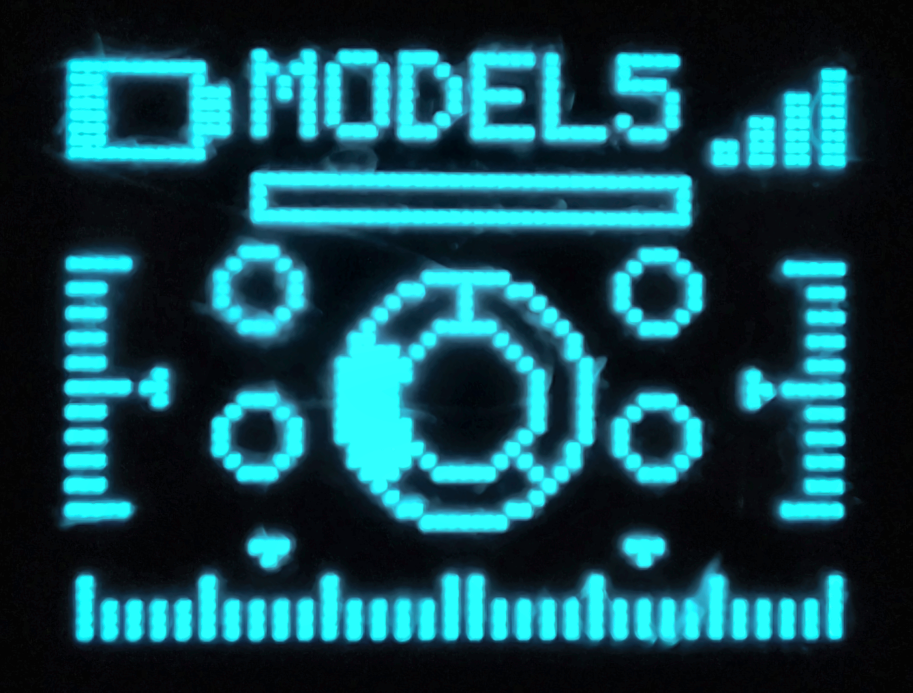

# MicroView RC

DIY multi-model RC transmitter/receiver project built around a **MicroView / ATmega328P transmitter**, an **ATtiny85 transmitter supervisor**, and an **nRF24L01+ receiver link**.

Current reference release: **4.1.18**.

<p align="center">
  
</p>

## Firmware versions

| Module | Version | Source |
|---|---:|---|
| MicroView transmitter | **4.1.18** | `firmware/transmitter/MicroView_TX/` |
| ATtiny85 supervisor | **3.17.1** | `firmware/supervisor/ATtiny85_Supervisor/` |
| Receiver | **3.20.0** | `firmware/receiver/MicroView_RX/` |

## Main features

- 10 independent model memories (`MODEL01` ... `MODEL10`)
- Model-specific receiver binding (`Rx001` ... `Rx010`)
- 4 proportional flight controls: roll, pitch, yaw and throttle
- Potentiometer channel plus 4 auxiliary controls
- Per-model expo, dual rate, trim, reverse, deadband and positive/negative endpoints
- `BIDIR` and `FWD ONLY` throttle modes
- RX battery telemetry through nRF24 ACK payloads
- TX battery monitoring through an ATtiny85 supervisor
- Buzzer / vibration alerts with L1, L2 and L3 levels
- RF debug page with last/average/max transaction time and retry count
- One-wire debug page for the MicroView <-> ATtiny85 link
- EEPROM-backed settings

## Documentation

The complete English user manual is here:

- [User manual](docs/USER_MANUAL.md)
- [Changelog](CHANGELOG.md)

The manual explains the main display, all menu items, RF diagnostics (`L`, `A`, `M`, `R`), one-wire diagnostics, alert levels, channel mapping, receiver outputs and calibration.

## Repository layout

```text
MicroView-RC/
├── README.md
├── LICENSE
├── CHANGELOG.md
├── firmware/
│   ├── transmitter/MicroView_TX/
│   ├── receiver/MicroView_RX/
│   └── supervisor/ATtiny85_Supervisor/
├── docs/
│   ├── USER_MANUAL.md
│   └── images/
├── hardware/
│   ├── schematic/
│   └── pcb/
└── releases/
```

## Radio configuration

The project uses an **nRF24L01+** link with software SPI.

### Transmitter nRF24 pins

| Signal | MicroView pin |
|---|---|
| CE | D0 |
| CSN | D1 |
| MOSI | D3 |
| MISO | D5 |
| SCK | D6 |
| ATtiny85 one-wire | D2 |

### Receiver nRF24 pins

| Signal | ATmega328P / Uno pin |
|---|---|
| CE | D7 |
| CSN | D8 |
| MOSI | D3 |
| MISO | D5 |
| SCK | D6 |

Validated radio settings in the current firmware include channel **76**, **250 kbps** data rate and automatic ACK/retries. The transmitter displays the nRF24 automatic retransmit count as `R`, read from `OBSERVE_TX.ARC_CNT` for compatibility with older RF24 libraries.

### Model-specific RF addresses

| Model | RF address |
|---|---|
| MODEL01 | `Rx001` |
| MODEL02 | `Rx002` |
| MODEL03 | `Rx003` |
| MODEL04 | `Rx004` |
| MODEL05 | `Rx005` |
| MODEL06 | `Rx006` |
| MODEL07 | `Rx007` |
| MODEL08 | `Rx008` |
| MODEL09 | `Rx009` |
| MODEL10 | `Rx010` |

Binding has been validated in hardware on **MODEL06** and **MODEL10**.

> **RF24 requirement:** the project uses software SPI. Keep `SOFTSPI` enabled/configured in the RF24 library as required by the sketches.

## Receiver outputs

| Function | Channel | RX pin |
|---|---:|---|
| Potentiometer | CH0 | D11 |
| Roll | CH1 | D9 |
| Pitch | CH2 | D10 |
| Yaw | CH3 | A3 |
| Throttle | CH4 | D12 |
| JR | CH6 | D2 |
| JL | CH7 | D4 |
| PB Right | CH8 | A1 |
| PB Left | CH9 | A2 |

## ATtiny85 supervisor

The ATtiny85 is intended to run from its **8 MHz internal clock**.

| Function | ATtiny85 pin |
|---|---|
| Buzzer | PB0 / physical pin 5 |
| Vibration driver | PB1 / physical pin 6 |
| TX battery ADC | PB3 / physical pin 2 |
| One-wire data | PB4 / physical pin 3 |

The one-wire link is connected between **MicroView D2** and **ATtiny85 PB4** through a **1 kOhm** series resistor. The current protocol is master/slave: the MicroView sends a command, then the ATtiny85 returns an ordered response containing timing/ACK/output-state/battery information.

## Building

The project has been developed with Arduino-compatible toolchains. The current recommended working environment is **Arduino IDE 2.x** with the required board cores and libraries installed.

Before compiling:

1. Install/configure the RF24 library and its software-SPI dependency (`DigitalIO`).
2. Ensure `SOFTSPI` is enabled as required by the project.
3. Build the transmitter for the MicroView / ATmega328P target.
4. Build the receiver for the ATmega328P / Arduino Uno-compatible target.
5. Build the supervisor for ATtiny85 at 8 MHz internal clock.

For the ATtiny85, use the selected ATTinyCore clock/BOD settings consistently. If clock/fuse settings are changed, use the core's **Burn Bootloader** operation once to program the fuses before uploading by ISP.

### Receiver operational defaults

Receiver **3.20.0** is delivered with Serial debug disabled and the fixed 3.800 V battery telemetry test value still enabled:

```cpp
#define RX_SERIAL_DEBUG 0
#define RX_DEBUG_ANSI 1
#define RX_BATTERY_TEST_MV 3800
```

Set `RX_BATTERY_TEST_MV` to `0` when you want to use the actual A0 battery-divider measurement.

## RF DEBUG example

```text
RF DEBUG
TX 5.2V
RX 3.8V
L1.5MS/R0
A 1.5MS
M 4.5MS
```

- `L`: latest `radio.write()` transaction time
- `A`: filtered average transaction time
- `M`: maximum observed transaction time
- `R`: automatic retransmissions used by the latest packet (`0` means no retry)

`L` measures the radio transaction and ACK/retry process. It is not the complete stick-to-servo latency.

## Releases and versioning

The transmitter version is used as the main public project version. Release **4.1.18** introduces the 10-model memory/address range together with receiver **3.20.0**. Stable releases should be tagged as:

```text
v4.1.18
v4.1.19
v4.1.20
```

The receiver and ATtiny85 keep their own independent firmware versions.

The current firmware bundle is also stored in [`releases/`](releases/). For normal GitHub use, future release ZIP files can additionally be attached to GitHub Releases rather than duplicated permanently in the repository.

## Hardware files

`hardware/schematic/` and `hardware/pcb/` are prepared for future schematic and PCB source files. They currently contain only `.gitkeep` placeholders.

## License

The project source and project-owned documentation are released under the [MIT License](LICENSE).

Third-party libraries and dependencies remain subject to their own licenses.

## Safety

RC systems can control motors, propellers and other moving equipment. Secure the model and disable propulsion while configuring, calibrating, binding or testing the system. Validate failsafe behavior before normal operation.
