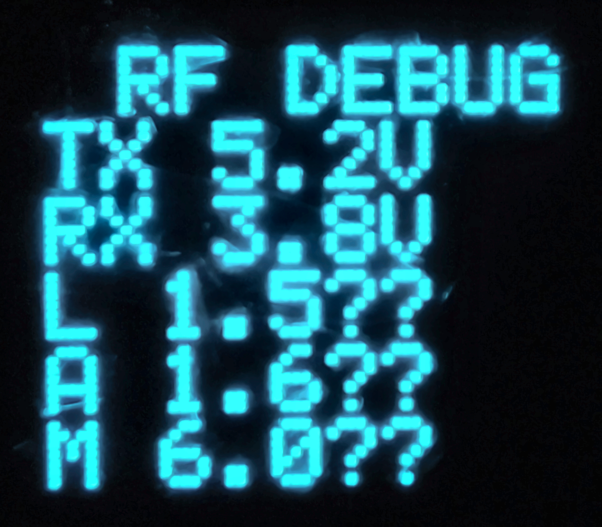
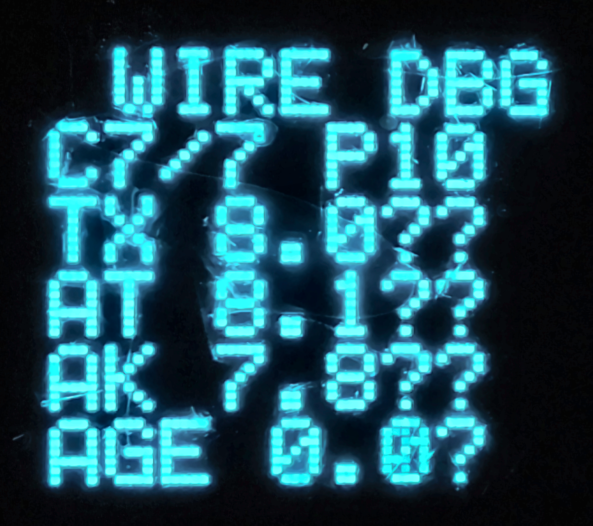
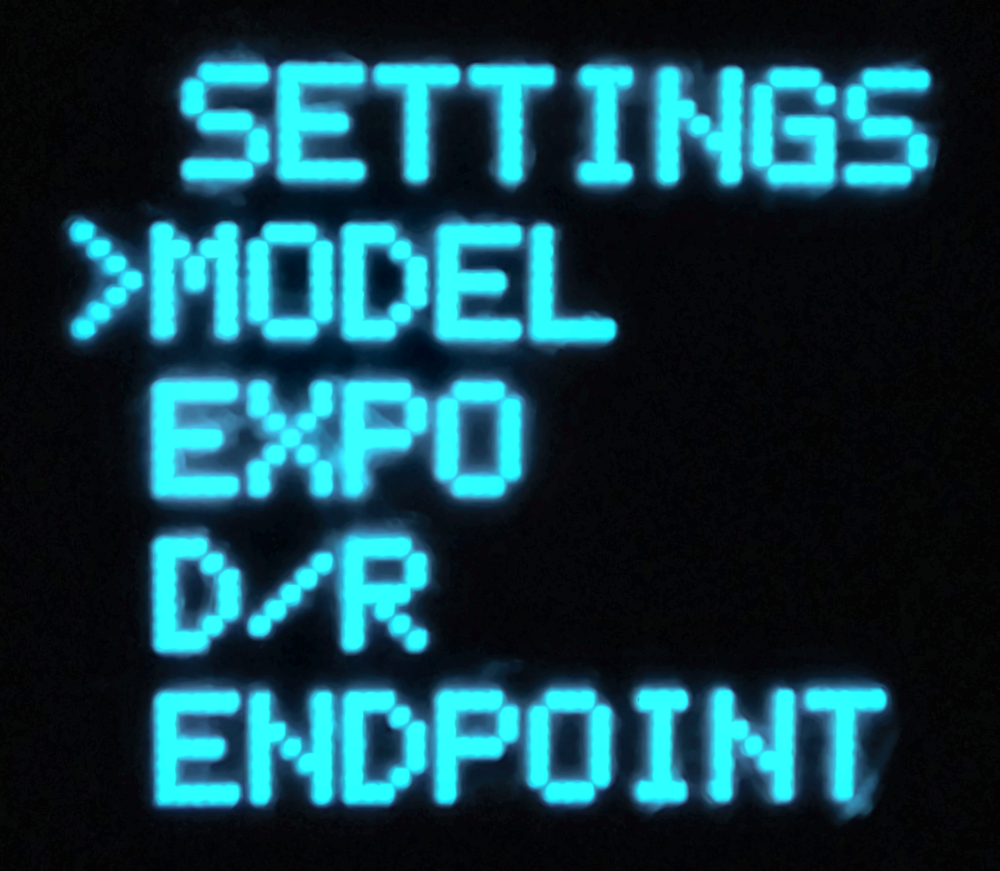
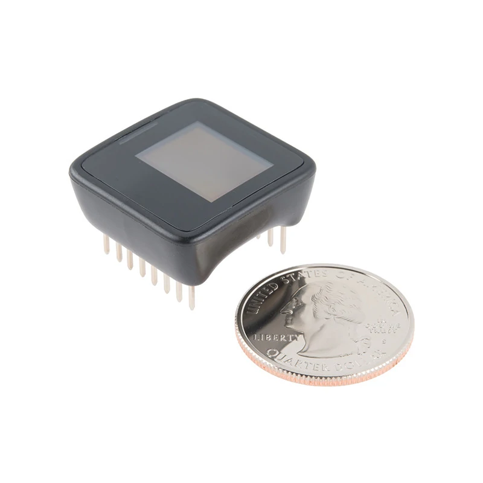
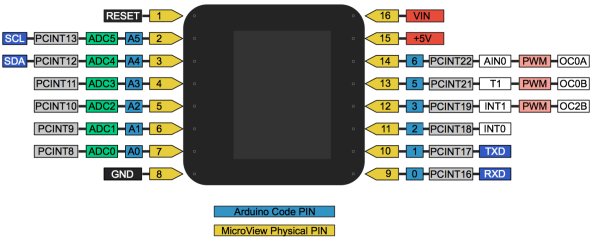

# MicroView RC 4.1.18 User Manual

<!--
Search metadata
Project: MicroView RC
Category: open-source DIY radio control / RC transmitter and receiver
Core hardware: SparkFun MicroView, ATmega328P, ATtiny85, nRF24L01+
Applications: drone, multirotor, quadcopter, RC car, RC truck, RC boat, RC airplane, fixed-wing aircraft, rover, robot, robotics
Technologies: Arduino, RF24, nRF24L01, telemetry, PWM, servo, ESC, SoftSPI, EEPROM
Related adaptation platforms: ESP32, STM32, RP2040, Raspberry Pi Pico, other microcontrollers
Keywords: Arduino RC, Arduino remote control, Arduino radio control, DIY RC transmitter, DIY RC receiver, RC transmitter Arduino, RC receiver Arduino, open source RC, nRF24L01 RC, RF24 radio control, ATmega328P RC, SparkFun MicroView, ATtiny85, RC telemetry, drone remote control, quadcopter controller, RC car controller, RC boat controller, RC airplane controller, robot remote control, robotics remote control, ESP32 RC project, STM32 RC project, RP2040 RC project, Raspberry Pi Pico RC project
Note: ESP32/STM32/RP2040/Pico are related adaptation/search terms; current firmware targets the MicroView/ATmega328P reference hardware.
-->

**MicroView transmitter + ATtiny85 supervisor + nRF24L01+ receiver**

This document is the GitHub-friendly English manual for firmware **4.1.18**.

## Firmware versions

| Module | Version | Notes |
|---|---:|---|
| MicroView transmitter | **4.1.18** | 10 model memories, `Rx001..Rx010` binding, RF DEBUG retry counter `R`, improved `L/R` layout |
| ATtiny85 supervisor | **3.17.1** | TX battery monitoring, buzzer/vibration output, one-wire master/slave protocol |
| Receiver | **3.20.0** | 10-model binding support, RX telemetry through ACK payload, endpoints, failsafe and AUX outputs |

---

## Project scope

MicroView RC is an open-source **Arduino-compatible DIY RC transmitter and receiver** for **drones/multirotors, RC cars, RC boats, RC airplanes/fixed-wing aircraft, robots, rovers and custom wireless-control projects**. The reference hardware combines the SparkFun **MicroView / ATmega328P**, an **ATtiny85** supervisor and an **nRF24L01+** radio link.

The current firmware is specifically built for the MicroView/ATmega328P platform. ESP32, STM32, RP2040 / Raspberry Pi Pico and similar microcontrollers are relevant future adaptation/reference platforms rather than direct build targets.

See [MicroView hardware and pin mapping reference](MICROVIEW_REFERENCE.md) for module specifications, the complete physical pin map and MicroView RC wiring.

---

## 1. Main controls

| Control | Function |
|---|---|
| **JR** | Right joystick push button. Validate/save in menus. |
| **JL** | Left joystick push button. Back/cancel in menus. |
| **PBR** | Right auxiliary push button. |
| **PBL** | Left auxiliary push button. Used during calibration. |
| **Right stick up/down** | Move through menus or change a value. |
| **Right stick right** | Enter a menu / move to the next editable field. |
| **JR + JL, held ~0.8 s** | Open `SETTINGS`. |

> **Safety:** secure the model and disable propulsion before calibration or configuration.

---

## 2. Main screen

<p align="center">
  
</p>

| Display element | Meaning |
|---|---|
| Battery icon, top left | **TX battery** level, scaled between `TX BAT MIN` and `TX BAT MAX`. |
| Model name, top center | Active model memory/name. |
| RF bars, top right | ACK success-rate estimate. This is **not RSSI**. |
| Horizontal bar under model name | **RX battery** received in the nRF24 ACK payload. |
| Left vertical cursor | `THROTTLE`. |
| Right vertical cursor | `PITCH`. |
| Bottom-left horizontal cursor | `YAW`. |
| Bottom-right horizontal cursor | `ROLL`. |
| Center circular gauge | Potentiometer `CH0`. |
| Four small symbols | AUX states: `JL`, `JR`, `PBL`, `PBR`. |

### RF bars

| Bars | ACK success rate |
|---:|---:|
| 4 | >= 98% |
| 3 | >= 90% |
| 2 | >= 75% |
| 1 | >= 50% |
| 0 | < 50% or no fresh ACK |

---

## 3. RF DEBUG

<p align="center">
  
</p>

The photo above comes from the preceding display layout. Version **4.1.18** keeps the 4.1.17 RF DEBUG layout: `R` remains on the `L` line, uppercase `MS` / `S` are used, and `/` separates latency from retry count.

Typical display:

```text
RF DEBUG
TX 5.2V
RX 3.8V
L1.5MS/R2
A 3.4MS
M16.8MS
```

| Term | Meaning |
|---|---|
| **TX** | Transmitter battery voltage measured by the ATtiny85. |
| **RX** | Receiver battery voltage returned in the nRF24 ACK payload. |
| **L** | **Last** `radio.write()` transaction duration. Includes RF transmission, retries and ACK. |
| **A** | Filtered **average** transaction duration. |
| **M** | **Maximum** transaction duration observed since RF statistics were initialized/reset. |
| **R** | Actual automatic retransmission count used by the latest packet. |

### How `R` is obtained in 4.1.18

Some older RF24 libraries do not provide `radio.getARC()`. Version 4.1.18 continues to read the nRF24L01+ hardware register directly:

```text
OBSERVE_TX.ARC_CNT = OBSERVE_TX bits 3..0
```

This provides the same retry count without requiring a newer RF24 library.

The transmitter uses:

```cpp
radio.setRetries(2, 10);
```

Therefore `R` normally ranges from **0 to 10**.

Examples:

```text
L1.5MS/R0  -> successful on the first transmission
L3.2MS/R2  -> two automatic retransmissions were required
L7.0MS/R5  -> several retries were required
```

> `L` is the RF transaction time around `radio.write()`. It is **not** the full stick-to-servo latency.

---

## 4. WIRE DBG

<p align="center">
  
</p>

`WIRE DBG` diagnoses the one-wire connection between **MicroView D2** and **ATtiny85 PB4**.

Typical display:

```text
WIRE DBG
C7/7 P10
TX 8.0MS
AT 8.1MS
AK 7.8MS
AGE 0.0S
```

| Field | Meaning |
|---|---|
| **C7/7** | Command requested by the MicroView / command decoded by the ATtiny85. |
| **P10** | Actual ATtiny output state: first bit = PB0 buzzer, second bit = PB1 vibration. |
| **TX** | Command pulse duration generated by the MicroView. |
| **AT** | Pulse duration measured by the ATtiny85 on PB4. |
| **AK** | ACK pulse duration returned by the ATtiny85. |
| **AGE** | Age of the latest valid command ACK. `>9.9S` means no recent ACK. |

### Alert command table

| Command | Level | Output |
|---:|---|---|
| 0 | STOP | PB0=0, PB1=0 |
| 1 | L1 | BUZZ |
| 2 | L1 | VIB |
| 3 | L1 | B+V |
| 4 | L2 | BUZZ |
| 5 | L2 | VIB |
| 6 | L2 | B+V |
| 7 | L3 | BUZZ |
| 8 | L3 | VIB |
| 9 | L3 | B+V |

Expected L3 examples:

```text
C7/7 P10  -> BUZZ only
C8/8 P01  -> VIB only
C9/9 P11  -> BUZZ + VIB
C0/0 P00  -> all outputs OFF
```

---

## 5. SETTINGS navigation

<p align="center">
  
</p>

Open `SETTINGS` by holding **JR + JL** for about **0.8 s**.

- Right stick **up/down**: select an item or change a value.
- Right stick **right**: enter the selected menu / move to the next field.
- **JR**: validate and save.
- **JL**: back/cancel.
- In `CALIB`, **PBL** captures/saves calibration steps.

When `DEBUG SCR = ON`, outside the menu:

- `JR`: `MAIN -> RF DEBUG -> WIRE DBG -> MAIN`
- `JL`: reverse order
- holding `JR + JL`: open `SETTINGS`

### Menu pages

```text
SETTINGS
>MODEL
 EXPO
 D/R
 ENDPOINT
```

```text
SETTINGS
>REVERSE
 TRIM
 THR MODE
 DEADBAND
```

```text
SETTINGS
>AUX MODE
 POT DISP
 RX BAT
 TX BAT
```

```text
SETTINGS
>RF POWER
 DEBUG SCR
 ALERTS
 CALIB
```

```text
SETTINGS
>RESET
```

---

## 6. Menu reference

| Menu | Scope | Choices / range |
|---|---|---|
| `MODEL` | Per model | 10 memories, rename, bind receiver |
| `EXPO` | Per model/axis | 0-70%, 5% steps |
| `D/R` | Per model/axis | 50-100%, 5% steps |
| `ENDPOINT` | Per model/axis | NEG/POS 50-125%, 5% steps |
| `REVERSE` | Per model | ON/OFF for axes and AUX channels |
| `TRIM` | Per model/axis | -20 to +20 |
| `THR MODE` | Per model | `BIDIR` / `FWD ONLY` |
| `DEADBAND` | Per model | 0-10% |
| `AUX MODE` | Per model/AUX | `INSTANT` / `TOGGLE` |
| `POT DISP` | Global | `CLASSIC` / `CUMUL` |
| `RX BAT` | Per model | MIN/MAX, 0.1 V steps |
| `TX BAT` | Global | MIN/MAX, 0.1 V steps |
| `RF POWER` | Global | `LOW` / `MID` / `MAX` |
| `DEBUG SCR` | Global | OFF/ON |
| `ALERTS` | Global | output type + L1/L2/L3 enable |
| `CALIB` | Global | stick center and full-range calibration |
| `RESET` | Global | restore defaults |

### MODEL

```text
MODEL01
>SELECT
 RENAME
 BIND RX
```

- `SELECT`: choose model 01-10. The selector scrolls while keeping four rows visible.
- `RENAME`: custom name up to 6 characters.
- `BIND RX`: bind the powered receiver to the active model memory.

Model/address mapping:

| Model | RF address |
|---|---|
| MODEL01 | `Rx001` |
| MODEL02 | `Rx002` |
| MODEL03 | `Rx003` |
| MODEL04 | `Rx004` |
| MODEL05 | `Rx005` |
| MODEL06 | `Rx006` |
| MODEL07 | `Rx007` |
| MODEL08 | `Rx008` |
| MODEL09 | `Rx009` |
| MODEL10 | `Rx010` |

> Power only **one receiver** while binding.

Hardware binding has been validated on **MODEL06** and **MODEL10**.

### EXPO

Softens response around stick center while keeping full travel available.

Range: **0-70%**, step **5%**.

### D/R

`D/R` = **Dual Rate**. Reduces overall channel amplitude.

Range: **50-100%**, step **5%**.

### ENDPOINT

Separate negative and positive travel limits.

Range: **50-125%**, step **5%**.

Endpoints are applied **after REVERSE**, so `NEG` and `POS` refer to the final output direction.

In `FWD ONLY` throttle mode, minimum is fixed and only forward `MAX` is adjustable.

### REVERSE

Reverses the final direction of:

```text
ROLL
PITCH
YAW
THR
JR
JL
PBR
PBL
```

Throttle reverse is locked in `FWD ONLY` mode.

### TRIM

Neutral offset for proportional axes.

Range: **-20 to +20**.

Throttle trim is forced to zero in `FWD ONLY` mode.

### THR MODE

**BIDIR**

- stick down = reverse
- stick center = neutral
- stick up = forward

**FWD ONLY**

- lower half through center = OFF/minimum
- center-to-top is remapped over the complete forward range

### DEADBAND

Dead zone around center to suppress small unwanted movements/jitter.

Range: **0-10%**.

### AUX MODE

- `INST` / `INSTANT`: active only while the button is held.
- `TGL` / `TOGGLE`: each press switches the stored state ON/OFF.

### POT DISP

- `CLASSIC`: local band around the potentiometer position.
- `CUMUL`: cumulative arc from minimum to current position.

### RX BAT

Receiver battery thresholds, stored per model.

- `MIN`: low-battery threshold.
- `MAX`: full-gauge reference.
- step: **0.1 V**.

### TX BAT

Global transmitter battery thresholds.

- `MIN`: low-battery threshold.
- `MAX`: full-gauge reference.
- step: **0.1 V**.

### RF POWER

| Display | RF24 power level |
|---|---|
| `LOW` | `RF24_PA_LOW` |
| `MID` | `RF24_PA_HIGH` |
| `MAX` | `RF24_PA_MAX` |

The RF power can be changed at runtime.

### DEBUG SCR

Enables the `RF DEBUG` and `WIRE DBG` pages.

### ALERTS

Output choices:

```text
OFF
BUZZ
VIB
B+V
```

Level choices:

```text
L1 ON/OFF
L2 ON/OFF
L3 ON/OFF
```

`OUTPUT = OFF` disables all physical alert outputs.

### CALIB

1. Center all proportional sticks and validate with `PBL`.
2. Move all proportional controls through their full travel and validate with `PBL`.

The firmware stores MIN / CENTER / MAX calibration values.

### RESET

Restores default settings and clears runtime states.

---

## 7. Alert levels

| Level | Purpose | Typical trigger | Pattern |
|---|---|---|---|
| **L1** | Information | menu/button/validation events | one short pulse |
| **L2** | Warning | battery pre-alert; short RF degradation | repeating double pulse |
| **L3** | Critical | battery <= MIN; sustained RF loss | repeating critical pattern |

Battery warning threshold:

```text
WARN = MIN + 15% x (MAX - MIN)
```

Output mapping:

| OUTPUT | PB0 buzzer | PB1 vibration |
|---|---:|---:|
| `OFF` | 0 | 0 |
| `BUZZ` | 1 | 0 |
| `VIB` | 0 | 1 |
| `B+V` | 1 | 1 |

---

## 8. RF diagnostics: L / A / M / R

Read `L` and `R` together.

| Observation | Interpretation |
|---|---|
| Low `L`, `R0` | Packet succeeded immediately. |
| `L` and `R` rise together | Extra latency comes from automatic RF retransmissions. |
| High `M`, moderate `A` | One or a few historical slow packets; not necessarily a continuous issue. |
| RF icon flashes | No fresh ACK for the link timeout period. |

Recent observed values with receiver Serial debug disabled:

```text
L = 1.5 MS
R = 0 most of the time
A = 1.5 MS
M = 4.5 MS
```

`A` is the better indicator of normal operation, while `M` keeps the worst transaction observed since the statistics were initialized/reset.

---

## 9. Channel mapping

| Channel | Function |
|---:|---|
| CH0 | Potentiometer |
| CH1 | ROLL |
| CH2 | PITCH |
| CH3 | YAW |
| CH4 | THROTTLE |
| CH6 | JR |
| CH7 | JL |
| CH8 | PBR |
| CH9 | PBL |

Receiver outputs:

| Function | RX pin |
|---|---|
| POT CH0 | D11 |
| ROLL CH1 | D9 |
| PITCH CH2 | D10 |
| YAW CH3 | A3 |
| THROTTLE CH4 | D12 |
| JR CH6 | D2 |
| JL CH7 | D4 |
| PBR CH8 | A1 |
| PBL CH9 | A2 |

---

## 10. Glossary

| Term | Meaning |
|---|---|
| **ACK** | Automatic acknowledgement returned by the nRF24 receiver. |
| **ACK payload** | Data carried back inside the ACK; used here for RX battery telemetry. |
| **ARC / R** | Automatic Retransmit Count from `OBSERVE_TX.ARC_CNT`. |
| **AUX** | Auxiliary digital channel. |
| **B+V** | Buzzer + vibration. |
| **BIDIR** | Bidirectional throttle with center neutral. |
| **D/R** | Dual Rate. |
| **EP** | Endpoint. |
| **FWD ONLY** | Forward-only throttle mode. |
| **INST** | Instantaneous AUX mode. |
| **JL / JR** | Left / right joystick push button. |
| **PBL / PBR** | Left / right auxiliary push button. |
| **RF** | nRF24L01+ radio link. |
| **RSSI** | Received Signal Strength Indicator. The transmitter does not display true RSSI. |
| **TGL** | Toggle AUX mode. |
| **THR** | Throttle. |
| **TX / RX** | Transmitter / receiver. |
| **WIRE** | One-wire MicroView D2 <-> ATtiny85 PB4 link. |

---

## 11. What changed in 4.1.18

Compared with 4.1.17:

- Increases model memories from **5 to 10**: `MODEL01` through `MODEL10`.
- Extends model-specific RF addresses to `Rx001` through `Rx010`.
- Adds a scrolling four-row model selector for the 64-pixel display.
- Updates the receiver to **3.20.0** so it can store and use model indexes 01 through 10.
- Changes the TX EEPROM layout/version to hold 10 complete model profiles.
- First boot after flashing TX 4.1.18 resets TX settings to defaults because of the new EEPROM layout.
- Keeps the 4.1.17 RF DEBUG behavior (`L`, `A`, `M`, `R`) unchanged.
- Hardware binding has been validated on **MODEL06** and **MODEL10**.
- ATtiny85 remains **3.17.1**.

---

## 12. SparkFun MicroView hardware reference

The transmitter is based on the **SparkFun MicroView**, a compact Arduino-compatible **ATmega328P** module with a built-in **64 x 48 OLED**.

<p align="center">
  
</p>

<p align="center">
  
</p>

For the complete 16-pin table, MicroView RC wiring, and source references, see [`MICROVIEW_REFERENCE.md`](MICROVIEW_REFERENCE.md).

Primary upstream references:

- [SparkFun Learn — MicroView Overview](https://learn.sparkfun.com/tutorials/sparkfun-inventors-kit-for-microview/microview-overview-)
- [SparkFun MicroView product repository — v10](https://github.com/sparkfun/MicroView/tree/v10)
- [SparkFun MicroView Arduino Library](https://github.com/sparkfun/SparkFun_MicroView_Arduino_Library)

---

## 13. Build notes

The project uses nRF24 **software SPI**. Keep `SOFTSPI` enabled in the RF24 library configuration as required by the existing project.

TX nRF24 pins:

```text
D0 = CE
D1 = CSN
D3 = MOSI
D5 = MISO
D6 = SCK
```

The 4.1.18 compatibility reader uses the same software-SPI pins only after `radio.write()` has completed.

### Receiver 3.20.0 defaults

```cpp
#define RX_SERIAL_DEBUG 0
#define RX_DEBUG_ANSI 1
#define RX_BATTERY_TEST_MV 3800
```

Serial debug is disabled for normal operation. The fixed **3.800 V** telemetry value remains enabled for bench testing; set `RX_BATTERY_TEST_MV` to `0` to use the real A0 battery-divider measurement.

### Build-size validation

```text
TX 4.1.18 : 25262 bytes flash (78%), 1136 bytes RAM (55%), 912 bytes RAM free
RX 3.20.0 :  7134 bytes flash (22%),  333 bytes RAM (16%), 1715 bytes RAM free
```


---

## Related search terms

`Arduino RC`, `Arduino remote control`, `DIY RC transmitter`, `DIY RC receiver`, `nRF24L01 radio control`, `RF24`, `RC telemetry`, `drone remote control`, `quadcopter controller`, `RC car controller`, `RC boat controller`, `RC airplane controller`, `robot remote control`, `robotics`, `ATmega328P`, `ATtiny85`, `SparkFun MicroView`, `SoftSPI`, `ESP32 RC project`, `STM32 RC project`, `RP2040 RC project`, `Raspberry Pi Pico RC project`.

ESP32/STM32/RP2040/Pico terms describe possible adaptation/reference use, not direct compatibility with the current firmware.
